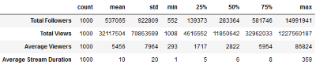

# Twitch's Top Streamers, Synopysis
Twitch is by far the most popular live streaming platform in the world, at least for gaming. Internet veterans will remember when Twitch.tv was JustIn.tv. As a passive consumer of various streamers I have oftened daydreamed about starting a streaming channel of my own. However, now that the landscape of streaming is so saturated, how does a newcomer stand out? What type of content do the top streamers produce? How many hours do they put in? Perhaps the answers to these questions will shed some light on what makes the top Twitch streamers succesful. 

## Data Collection
The dataset was allocated by a web scraper using Selenium. Data scraped from sullygnome.com. Average values are averaged over the last 30 days. Data points for this dataset were collected for August 2020.

Features:
- Channel name
- Partner status
- Mature content
- Language
- Date Created
- Total Followers
- Total Views 
- Average Viewers
- Average Stream Duration
- Game 1 (Most played game)
- Game 2 (Second most played game)
- Game 3 (Third most played game)

## EDA

                                                
##### Descriptive statistics of numerical features:
  

##### Boolean features:  
  

##### Checking total followers vs average viewers based on corr. table:

#### Average Stream Duration

After graphing the average stream length of the top 100 streamers, I noticed that there were 8 outliers that all exceeded a 20 hour average. I calculated an average for the entire dataset that excluded about 50 outliers that had over a 24 average length. Most of these outlier channels were for organizations or groups such as "ESL_CSGO", "BeyondTheSummit", and "Monstercat" to name a few. The true average stream duration that I found based on this dataset is 6.3 hours.

#### Games

Not too surprising that 'Fall Guys' and 'Among Us' are in the top 10 as they can be considered the current "flavor of the week". 'Just Chatting' is vague due to the fact that it is used (mostly) whenever a streamer is not gaming; either talking to the chat OR reacting to content (usually YouTube), but again, this could be for any number of topics. Industry giants (both old and new) make up the rest of the list, all except for Minecraft and GTAV can be considered as "competetive" games.

## Findings
Based on the EDA conducted on this dataset, there are clear trends among top streamers that can be adapted by up and coming creators. Simplified, being a top streamer is a job. The average stream length for the top 1000 alone was 6 hours, those among the top 100 trend towards a 8 hour average. Secondly, get partnered. 95% of the top 1000 were partnered, which allows viewers to subsribe and provides the streamer with a steady income. While the game findings illustrate the hottest and most popular games, it fails to acknowledge niche audiences for games such as "Super Smash Bros. Melee". Nearly half of the channels had "English" as their language. 

## Environment and Resources:
- **Python**: 3.8 
- **Packages**: pandas, numpy, matplotlib, seaborn, selenium
- [Selenium](https://selenium-python.readthedocs.io/)
- [Sully Gnome](https://www.sullygnome.com)
- [mplcyberpunk](https://github.com/dhaitz/mplcyberpunk)
